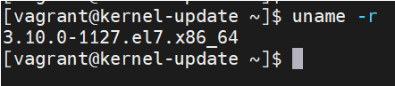
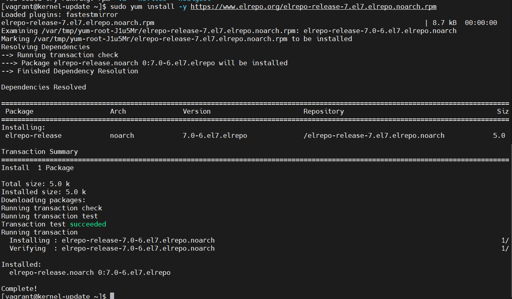
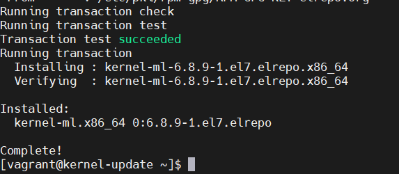

# homework-vagrant
Описание домашнего задания
1. Запустить ВМ с помощью Vagrant.
2. Обновить ядро ОС из репозитория ELRepo.
3. Оформить отчет в README-файле в GitHub-репозитории.

---
- Этап 1: Загружена виртуальная машина из Vagrantfile c ядром 4.18 


- Этап 2: Подключен репозиторий. Выполнены команды из инструкции 
```bash
sudo yum install -y https://www.elrepo.org/elrepo-release-7.el7.elrepo.noarch.rpm 
```


- Этап 3: Обновлено ядро. Выполнены команды из инструкции
```bash
sudo yum --enablerepo elrepo-kernel install kernel-ml -y
```


- Этап 4: Обновляем конфигурацию загрузчика и выбираем загрузку нового ядра по-умолчанию. Проверяем версию ядра
```bash
sudo grub2-mkconfig -o /boot/grub2/grub.cfg
sudo grub2-set-default 0
```

